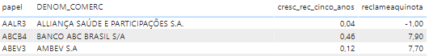

# Análise dos dados disponíveis.
O objetivo dessa pasta é construir as consultas SQL que serão utilizadas para a exploração e descoberta dos dados, e entender como eles podem ser relacionados.
Também nessa pasta estão apresentados alguns prints das primeiras análises no Power BI.

## SQL

O banco de dados escolhido para armazenar os dados foi o MySQL:latest, e para evitar problemas de depenências, será utilizado o Docker. 
Para popular as tabelas com os dados, é utilizado o Python, que coleta os arquivos parquet, faz transformações e carrega no MySQL.

Para montar as imagens, faça o seguinte:
1 Certifique-se de estar na pasta SQL;
2 No terminal, digite docker-compose up;
3 Docker run *image_id python analytics.py ***(Para popular as tabelas)***

Com esses três passos, você terá o banco de dados db populado com as tabelas cad, dfp_cia_aberta_DRE_con_2023, fundamentei e fundamentus.
Para checar as tabelas, faça o seguinte:
1 docker exec -it container_ID bash
2 mysql -u root -p
3 root
4 use db
5 show tables

Para a primeira análise, foi criada uma consulta, que cria uma OBT com dados das quatro tabelas.

## Criação da tabela obt_b3.
```
CREATE TABLE obt_b3 AS
WITH 
# início: Criando uma tabela com os tickers e seus cnpjs
ticker_on AS (
    SELECT cnpj, tickeron AS ticker
    FROM fundamentei 
    WHERE cnpj <> 'na'
),
ticker_pn AS (
    SELECT cnpj, tickerpn AS ticker 
    FROM fundamentei 
    WHERE cnpj <> 'na'
),
tickers AS (
    SELECT distinct * FROM ticker_on 
    UNION ALL 
    SELECT distinct * FROM ticker_pn
),
# fim: Criando uma tabela com os tickers e seus cnpjs

#-----------------------------------------------------------------------------------------------------

# início: Criando um dataset com os atributos das tabelas cad e  fundamentei
fundamentei_distinct AS (

SELECT 

	DISTINCT
	f.cnpj,
	f.atuacao,
	f.segmento_listagem,
	f.tag_alongon,
	f.tag_alongpn,
	f.freefloaton,
	f.freefloatpn,
	f.on_percent,
	f.pn_percent,
	f.reclameaquinota,
	f.reclameaquitexto

FROM fundamentei f 

),


atributos AS (
SELECT 
	cad.CNPJ_CIA,
	cad.DENOM_COMERC,
	cad.DT_REG,
	cad.SIT,
	cad.AUDITOR,
	f.atuacao,
	f.segmento_listagem,
	f.tag_alongon,
	f.tag_alongpn,
	f.freefloaton,
	f.freefloatpn,
	f.on_percent,
	f.pn_percent,
	f.reclameaquinota,
	f.reclameaquitexto
FROM cad

LEFT JOIN fundamentei_distinct AS f 
ON cad.cnpj_cia = f.cnpj

WHERE cad.SIT = 'ATIVO' AND cad.TP_MERC = 'BOLSA'
    
),
# fim: Criando um dataset com os atributos das tabelas cad e fundamentei

#-----------------------------------------------------------------------------------------------------

# Início: incluindo cnpj na tabela fundamentus para fazer join com os atributos
fundamentus2 AS	(
SELECT 
	cnpj,
	f.papel, 
	f.cotacao, 
	f.pl, 
	f.pvp, 
	f.psr, 
	f.div_yield, 
	f.p_ativo, 
	f.p_cap_giro, 
	f.p_ebit, 
	f.p_ativ_circ_liq, 
	f.ev_ebit, 
	f.ev_ebitda, 
	f.mrg_ebit, 
	f.mrg_liq, 
	f.liq_corr, 
	f.roic, 
	f.roe, 
	f.liq_2meses, 
	f.patrim_liq, 
	f.div_bruta_patrim, 
	f.cresc_rec_cinco_anos
FROM tickers
LEFT JOIN fundamentus f
ON ticker = papel 
	)
# Início: incluindo cnpj na tabela fundamentus para fazer join com os atributos
	
#-----------------------------------------------------------------------------------------------------
	
# Criando a tabela obt_b3 com todos os dados das tabelas fundamentus,
# fundamentei, cad e dfp_cia_aberta_DRE_con_2023
	
SELECT
	-- ROW_NUMBER() over(ORDER BY f.cnpj) AS sk_obt,
	f.cnpj,
	f.papel, 
	f.cotacao, 
	f.pl, 
	f.pvp, 
	f.psr, 
	f.div_yield, 
	f.p_ativo, 
	f.p_cap_giro, 
	f.p_ebit, 
	f.p_ativ_circ_liq, 
	f.ev_ebit, 
	f.ev_ebitda, 
	f.mrg_ebit, 
	f.mrg_liq, 
	f.liq_corr, 
	f.roic, 
	f.roe, 
	f.liq_2meses, 
	f.patrim_liq, 
	f.div_bruta_patrim, 
	f.cresc_rec_cinco_anos,
	a.*,
	dfp.DT_REFER, 
	dfp.VERSAO, 
	dfp.DENOM_CIA, 
	dfp.CD_CVM, 
	dfp.GRUPO_DFP, 
	dfp.MOEDA, 
	dfp.ESCALA_MOEDA, 
	dfp.ORDEM_EXERC, 
	dfp.DT_INI_EXERC, 
	dfp.DT_FIM_EXERC, 
	dfp.CD_CONTA, 
	dfp.DS_CONTA, 
	dfp.VL_CONTA, 
	dfp.ST_CONTA_FIXA
	
FROM fundamentus2 f
LEFT JOIN atributos a
ON f.cnpj = a.CNPJ_CIA
LEFT JOIN dfp_cia_aberta_DRE_con_2023 dfp
on f.CNPJ = dfp.CNPJ_CIA 
WHERE papel is not null;	
```

A partir da obt, foi desenvolvida uma outra consulta para a primeira análise. Essa consulta visa explorar a relação entre as tabelas fundamentus, cad e fundamentei. Usando colunas dessas tabelas combinadas, podemos checar se o relacionamento entre as tabelas está correto na criação da obt, bem como podemos entender se todos os dados contidos na tabela fundamentus têm seus respectivos atributos na tabela cad e fundamentei.

```
SELECT 

distinct
papel,
coalesce(DENOM_COMERC,'na') as DENOM_COMERC,
div_yield,
coalesce(atuacao,'na') as atuacao,
coalesce(segmento_listagem,'na') as segmento_listagem,
cresc_rec_cinco_anos,
coalesce(SUBSTRING_INDEX(reclameaquinota, ' / ', 1),-1) as reclameaquinota,
coalesce(reclameaquitexto,'na') as reclameaquitexto,
patrim_liq

FROM obt_b3 ob 

```

## Power BI
No Power BI foi feita a análise de crescimento de receita no últimos cinco anos, mostrando a relação entre crescimento e nota do reclame aqui, crescimento por atuação, empresas que mais cresceram e número de empresas agrupadas por faixa de crescimento e nota.


## Considerações
As primeiras validações mostram que não há divergência no relacionamento entre as tabelas fundamentus, cad e fundamentei:
A imagem abaixo mostra campos da tabela obt, que vem de três tabelas diferentes.

Papel: fundamentus
DENOM_COMERCIAL: cad
crescimento: fundamentus
Nota reclame aqui: fundamentei
 <br>
* Há casos em que a nota é mencionada como -1, e estes casos indicam que no momento da extração dos dados não havia nota.
* Há casos em que a DENOM_COMERCIAL não é encontrada, para estes será buscada uma outra fonte de dados mais completa ou suplementar.

Ao validar o crescimento e a nota do reclame aqui, que são dados de duas tabelas distintas, checando nos sites:
https://www.fundamentus.com.br/resultado.php e https://www.reclameaqui.com.br/

Pode haver pequenas distorções, pois a extração utilizada para este estudo de caso foi feita há mais de 20 dias.

Próximos passos:
Checar se todos os campos numéricos foram devidamente conovertidos.
Criar análise de vendas de bens e serviços por cpnj de acordo com o última divulgação de resultados de 2023.


